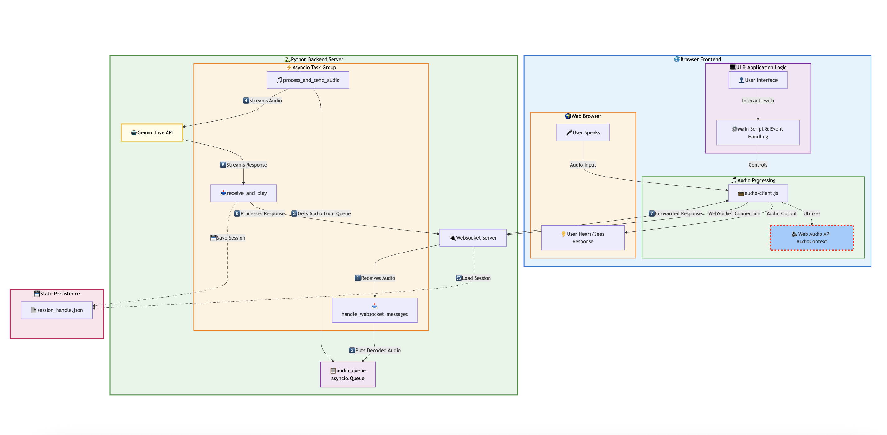

# Multimodal Live API UI

This project contains the user interface for the Multimodal Live API. It features a Python backend with two server options and a Node.js/Express frontend.

## Prerequisites

-   Node.js (which includes npm)
-   Python 3.9+
-   An authenticated Google Cloud SDK (`gcloud auth application-default login`)

## Getting Started

### 1. Backend Setup

First, clone the repository and install the required Python packages.

1.  **Clone the repository:**
    ```bash
    git clone https://github.com/gauravz7/pythonsdk-localbot.git
    cd pythonsdk-localbot
    ```

2.  **Create and activate a Python virtual environment:**
    ```bash
    python -m venv venv
    source venv/bin/activate
    # On Windows: venv\Scripts\activate
    ```

3.  **Install Dependencies:**
    Navigate to the `server` directory and install the required packages:
    ```bash
    cd server
    pip install -r requirements.txt
    cd ..
    ```

4.  **Configure Google Cloud:**
    Open `server/common.py` and set your `PROJECT_ID` and `LOCATION`.

---

### Backend Option 1: Run with FastAPI Server (Recommended)

This method uses a single command to run the FastAPI server, which handles both the WebSocket connection and serves the frontend client.

1.  **Start the Server:**
    From the project root directory, run the following command:
    ```bash
    python server/server_fastapi.py
    ```
    The server will start on `0.0.0.0:8765`.
---

### Backend Option 2: Run with Vanilla Python WebSocket Server

This method runs the original, standalone WebSocket server. You will need to serve the frontend files using a separate process and modify the client's WebSocket URL.

1.  **Start the Backend Server:**
    From the project root directory, run the following command:
    ```bash
    python server/server.py
    ```
    The WebSocket server will start and listen on `0.0.0.0:8765`.

2.  **Modify the Client:**
    Open `client/index.html` and change the WebSocket connection URL. Find this line:
    ```javascript
    const audioClient = new AudioClient('ws://localhost:8765/ws');
    ```
    And change it to:
    ```javascript
    const audioClient = new AudioClient('ws://localhost:8765');
    ```


### 2. Frontend Setup

1.  **Navigate to the client directory:**
    ```bash
    cd client
    ```

2.  **Install Frontend Dependencies:**
    ```bash
    npm install
    ```

3.  **Start the Frontend Development Server:**
    This command starts the frontend and watches for changes.
    ```bash
    npm run dev
    ```
    The frontend will be available at [http://localhost:8080](http://localhost:8080).


## System Architecture



### Frontend Javascript + NodeJS
- **Initialization**: The main application script instantiates audio-client.js.
- **Connection**: The AudioClient establishes a persistent, two-way connection to the backend using the WebSocket API.
- **Recording (Capture on the Audio Thread)**:
  - When the user starts recording, the AudioClient uses the AudioContext to access the microphone stream.
  - An ScriptProcessorNode (or AudioWorklet) listens for audio data. Crucially, this event handler runs on the dedicated audio thread.
  - As audio chunks arrive, they are encoded and sent over the WebSocket to the server.
- **Playback (Playback on the Audio Thread)**:
  - The AudioClient receives audio response chunks from the server.
  - These chunks are pushed into a queue.
  - The AudioContext is used to decode the audio data into playable buffers.
  - It then schedules these buffers for seamless, back-to-back playback, again ensuring this entire process happens on the audio thread for perfect timing.

### Backend - Python

The stack consists of Python leveraging asyncio for non-blocking I/O, the websockets library for the transport layer, The system's design is based on several decoupled components, each with a distinct responsibility. This architecture ensures scalability, maintainability, and efficient handling of concurrent operations

| Feature | Description |
|---|---|
| **Real-Time Audio Streaming** | Manages continuous, low-latency, bidirectional streaming of audio data between the client and the Gemini API. |
| **WebSocket Communication** | Utilizes the websockets library to establish a persistent, full-duplex communication channel with clients. |
| **Asynchronous Architecture** | Built entirely on Python's asyncio framework to handle multiple clients and I/O operations concurrently without blocking. |
| **Gemini Live API Integration** | Directly integrates with the google-generativeai library's live.connect feature for stateful, real-time interaction. |
| **Session Resumption** | Implements a mechanism to save and load session handles, allowing clients to resume previous conversations. |
| **Dynamic Voice Activity Detection (VAD)** | Configures and utilizes the Gemini API's server-side VAD to intelligently detect the start and end of user speech. |
| **Bidirectional Transcription** | Provides real-time transcription of both the user's input audio and the model's generated audio response. |
| **Interruption Handling** | Supports the ability for the user to interrupt the model's speech, providing a more natural conversational flow. |
| **Modular Design** | Employs a base server class (BaseWebSocketServer) for core connection logic, promoting extensibility and separation of concerns. |

### Core Components

- **System Flow**: Clients send Base64 PCM audio via WebSocket, which gets decoded and queued by the ingress handler. The egress handler streams queued audio to Gemini's API while the response handler processes concurrent API responses. Response demultiplexing handles different message types: model_turn (audio), transcription data, and session metadata.
- **WebSocket Server**: The server handles client connections where BaseWebSocketServer provides generic connection management while subclasses implement protocol specifics. Built on websockets.serve(), it manages HTTP/WebSocket upgrades and spawns isolated session handlers per connection.
- **Gemini API Handler**: This component manages individual Gemini Live API sessions via client.aio.live.connect() with configuration for response modalities, audio transcription, and server-side VAD. It maintains session state and handles resumption using persistent API handles through async context managers.
- **Concurrent Task Orchestrator**: Full-duplex communication is achieved through asyncio.TaskGroup coordinating three coroutines per client: ingress handling (WebSocket messages), egress handling (API streaming), and response processing. This prevents I/O blocking and maintains low-latency voice interactions.
- **Asynchronous Audio Buffer**: A producer-consumer pattern using asyncio.Queue decouples client data from API streaming. The WebSocket handler encodes audio and enqueues bytes while the processor dequeues for API transmission
- **Session Persistence**: Simple file-based persistence saves session handles from session_resumption_update responses to JSON files. This enables conversation continuity after disconnections but requires distributed storage (Redis) for production scaling. Right now the basic implementation takes only the saved session.

## Contributing

1.  **Commit Changes:**
    After making changes, commit them with a descriptive message:
    ```bash
    git commit -am "Your descriptive commit message"
    ```

2.  **Push to GitHub:**
    Push your changes to the main branch of the repository:
    ```bash
    git push
